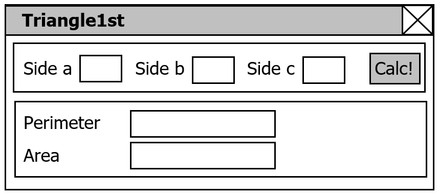

# Graphical User Interface with JavaFx

The objective of this exercise is to experiment with graphical user interfaces and to collect or refresh the experience with Java.

## Triangle1st GUI Application _(3 points)_

Develop a Java-Application named _Triangle1st_ containing a graphical user interface based on [JavaFx](https://openjfx.io/), which calculates the **perimeter** and the **area** of a triangle. Figure 1 shows one way the user interface may look like; however you are free to implement your ideas.


Figure 1: Proposal for designing the user interface layout.

### Prerequisites

- [x] Java 15 (or newer) SDK (If you use an IDE like Eclipse or IntelliJ, Java is **already included** :sunglasses:.).
- [x] Maven 3. (If you use an IDE like Eclipse or IntelliJ, Maven is **already included** :sunglasses:.)
	- see http://maven.apache.org/install.html
- [x] An IDE or code editor of your choice.

> Confirm your installation with `mvn -v` in a new shell. The result should be similar to:

```
$ mvn -v
Apache Maven 3.8.2 (ea98e05a04480131370aa0c110b8c54cf726c06f)
Maven home: C:\Users\winterer\.tools\apache-maven-3.8.2
Java version: 15, vendor: Oracle Corporation, runtime: C:\Program Files\Java\jdk-15
Default locale: en_GB, platform encoding: Cp1252
OS name: "windows 10", version: "10.0", arch: "amd64", family: "windows"
```

### Instructions

This maven project is already set up for JavaFx based GUI applications. It also contains a small example application - `App.java`.

1. Import this git repository into your favourite IDE.

1. Make sure, you can run the sample application without errors.
	- Either run it in your IDE
	- Via command line, run it with `mvn clean javafx:run`.

1. Now remove the sample app and create a custom application class `Triangle1st` in package `at.fhhagenberg.sqe.exercise1`.

1. Open the file `pom.xml`
	- rename the `artifactId` to `triangle1st`.
	- update the `mainClass` property in the configuration section of the plugin `org.openjfx:javafx-maven-plugin` to reflect you real application class.

1. Update the file `src/main/java/module-info.java` to export your newly created java package `at.fhhagenberg.sqe.exercise1`. 

Please keep in mind:
- Develop the GUI, for example, by writing it manually, using JavaFx.
- Create a useful layout that keeps intact if the application is resized. 
- The application should contain a button to close the window.
- Add a comment at the beginning of every source code file containing your full name(s) and your student ID number(s).
- To start your application, type `mvn javafx:run`.

Java libraries and applications are stored in JAR archive files (Java archive). Create a JAR file `triangle1st-0.0.1.jar` from your project containing the executable binaries (class files) and the necessary resources.

You can build your project with maven with

```
mvn clean package
```

The resulting archive (`.jar` file) is in the `target` directory.

### Submission

When you're done...

- [x] push your changes to your upstream repository on GitHub.
- [x] on GitHub, [create a release][GitHub creating releases] with version `v0.1`.
- [x] upload the [link to your release][GitHub linking to releases] on the e-learning platform until the specified date and time before the next lecture.
- [x] Only complete submissions adhering to all of the above requirements are considered. Late submissions, submissions via email or submissions failing to meet the specified requirements will not be accepted.

## Input Validation _(1 point)_

### Instructions

Use exception handling or related approaches to make sure that no exceptions will be raised in case of invalid inputs, e.g., non-numerical characters. 
- React on _non-numerical inputs_ by showing an error message, for example by opening a dialog (see [JavaFX Alert](https://openjfx.io/javadoc/15/javafx.controls/javafx/scene/control/Alert.html)). Hint: It is sufficient to check the input when the button _Calc!_ is clicked.
- Catch also other exceptions and react by displaying the exceptions’ message as error description.

### Submission

When you're done...

- [x] push your changes to your upstream repository on GitHub.
- [x] on GitHub, [create a release][GitHub creating releases] with version `v0.2`.
- [x] upload the [link to your release][GitHub linking to releases] on the e-learning platform until the specified date and time before the next lecture.
- [x] Only complete submissions adhering to all of the above requirements are considered. Late submissions, submissions via email or submissions failing to meet the specified requirements will not be accepted.

## Externalization of text messages _(2 points)_

Java provides mechanisms for externalization/internationalization of applications, i.e., text messages and labels are not stored as constants in the code but in separate property files that can be translated into different languages without changing the code that uses them.

### Instructions

In order to support language-independent applications all strings have to be replaced by symbolic names. The connection between the symbolic names and the actual text messages and labels is maintained by an object of the class `ResourceBundle`. 

All major IDEs (e.g. Eclipse, IntelliJ) support internationalization of text messages. Search for '<name-of-your-IDE> externalize strings' to find out how to do it. You should end up having all strings replaced by method calls that use a symbolic name to look up the appropriate translated string in a properties file like `messages.properties`.

### Submission

When you're done...

- [x] push your changes to your upstream repository on GitHub.
- [x] on GitHub, [create a release][GitHub creating releases] with version `v0.3`.
- [x] upload the [link to your release][GitHub linking to releases] on the e-learning platform until the specified date and time before the next lecture.
- [x] Only complete submissions adhering to all of the above requirements are considered. Late submissions, submissions via email or submissions failing to meet the specified requirements will not be accepted.

##	Documentation using JavaDoc _(1 point)_

### Instructions

The tool JavaDoc generates documentation in HTML format from source code comments between `/** ... */` (see [How to Write Doc Comments for the Javadoc Tool](http://www.oracle.com/technetwork/java/javase/documentation/index-137868.html)).

- Write comments for all the classes and methods you developed and
- generate HTML documentation with

```
mvn compile javadoc:javadoc
```

_Hint: The result can be found in `target\site\apidocs`. (open `index.hml` in your browser.)_

### Submission

When you're done...

- [x] push your changes to your upstream repository on GitHub.
- [x] on GitHub, [create a release][GitHub creating releases] with version `v0.4`.
- [x] upload the [link to your release][GitHub linking to releases] on the e-learning platform until the specified date and time before the next lecture.
- [x] Only complete submissions adhering to all of the above requirements are considered. Late submissions, submissions via email or submissions failing to meet the specified requirements will not be accepted.

## Test Cases _(2 points)_

### Instructions

Consider what input should be used to test the application `Triangle1st`. Create a table containing the columns a, b and c for input parameter and an additional column result to document the expected results. Have at least 10 test cases (i.e., rows in the table), which you store in the file `/src/test/TestCases.md`. Use markdown syntax, e.g.:

| a     | b     | c     | | peri  | area  |
|-------|-------|-------|-|-------|-------|
| ...   | ...   | ...   | | ...   | ...   |

### Submission

When you're done...

- [x] push your changes to your upstream repository on GitHub.
- [x] on GitHub, [create a release][GitHub creating releases] with version `v0.5`.
- [x] upload the [link to your release][GitHub linking to releases] on the e-learning platform until the specified date and time before the next lecture.
- [x] Only complete submissions adhering to all of the above requirements are considered. Late submissions, submissions via email or submissions failing to meet the specified requirements will not be accepted.

## Questions and Answers _(1 point)_

### Instructions

Read the article by Noel Nyman: _Does a Bug Make a Noise When It Falls in the Forest?_ (`bug-in-forest.pdf` on the e-learning plattform) and answer the following questions in line:

#### Question 1: In the case described in the article, what were the failure, fault and error? (Stick with the definitions from the lecture.)

TODO: Insert your answer here!

#### Question 2: In a software project, who should decide whether a problem is a bug or not?

TODO: Insert your answer here!

### Submission

When you're done...

- [x] push your changes to your upstream repository on GitHub.
- [x] on GitHub, [create a release][GitHub creating releases] with version `v0.6`.
- [x] upload the [link to your release][GitHub linking to releases] on the e-learning platform until the specified date and time before the next lecture.
- [x] Only complete submissions adhering to all of the above requirements are considered. Late submissions, submissions via email or submissions failing to meet the specified requirements will not be accepted.

[GitHub creating releases]: https://help.github.com/articles/creating-releases/
[GitHub linking to releases]: https://help.github.com/articles/linking-to-releases/
